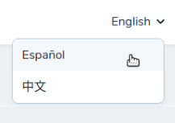

# Laravel Locale Switcher
> Adds locale switching to a Laravel project.

Give users ability to toggle between languages. Provides template for language dropdown. Selected language will be saved to the database.



## Installation

Add the following to `composer.json`:

```js
{
    "repositories": [
        {
            "type": "vcs",
            "url": "https://github.com/vectorwyse/laravel-locale-switcher"
        }
    ],
    "require": {
        "vectorwyse/locale-switcher": "^1.1"
    },
}
```
Followed by:

```sh
composer install
```

## Usage

Add list of supported locales and descriptions in `config/app.php`. Make sure you have all the language files!

```php
'available_locales' => [
    'en' => 'English',
    'es_es' => 'Español',
    'zh_TW' => '中文',
],
```

In your header template, add the following:

```blade
<dropdown class="ml-auto h-9 flex items-center dropdown-right">
    @include('locale-switcher::dropdown')
</dropdown>
```

If you would like to override the existing template and style your own dropdown, make your own and put it in `resources/views/vendor/locale-switcher/dropdown.blade.php`
